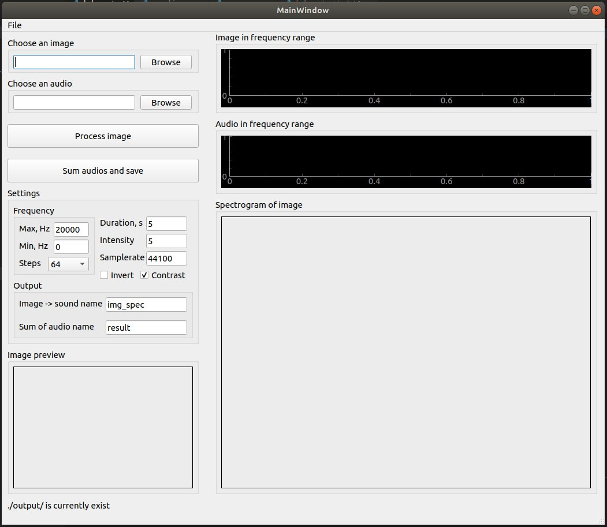
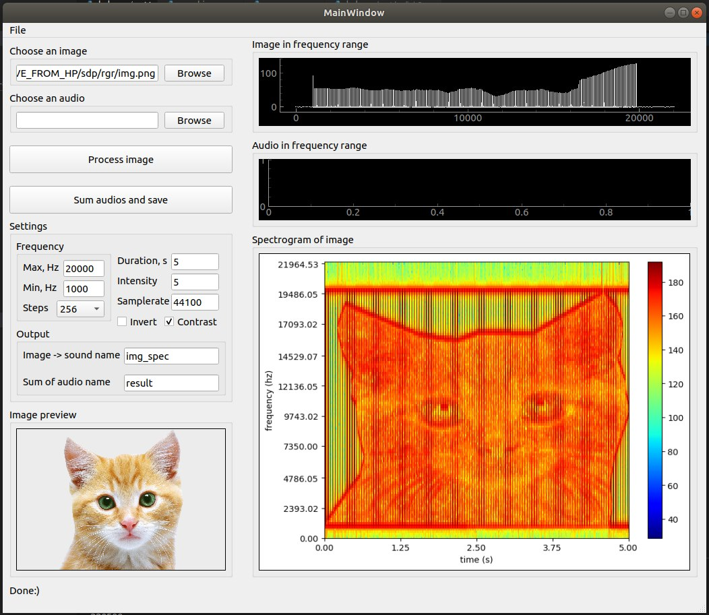
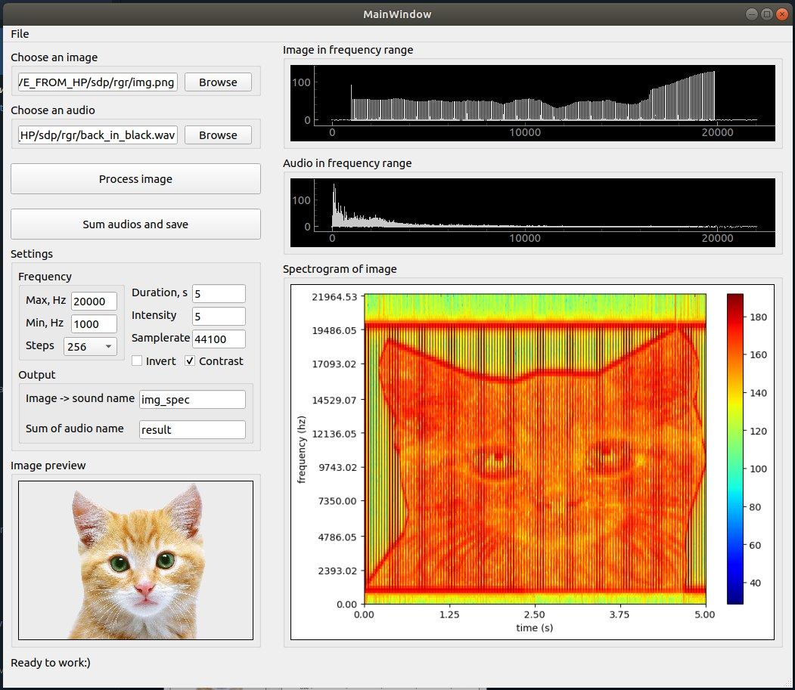

# Image2Audio converter manual

This project is about creating a sound that represents an image. As you may have guessed, an image is a 3D (or 5D if you do RGB) media : there is width, height and pixel intensity (greyscale or Red, Green and Blue), while sound is a 2D media: there is time and points.

## How to do it?
So to actually create the sound wave matching a particular spectrogram, all we need to do is sum a bunch of cosine waves of chosen frequency, easy. Our X axis in the image will translate to a frequency while our Y axis will be the time. Finally, the blue/red gradient is determined by the amplitude of the wave which will match the pixel intensity at that point of the image. And so we just created 3 dimensions out of a 2 dimensional object (sound wave).

## How to install
For installing run the following set of commands:
```
$ git clone https://github.com/DrCaH4ec/image_to_audio_converter
$ cd image_to_audio_converter
$ ./install
```
This will download source code and install all prerequisites.

## How to use
To start the application run:
```
$ ./img2audio.py
```



For upload the image press **Browse** button in **Choose an image** box and choose an image.
> ### After that you can set some settings:
> 
> - **Max** and **Min** - there are minimum and maximum frequencies in Hz between which image will be situated
> - **Steps** - amount of frequencies between **Min** and **Max** in which the image will be divided
> - **Duration** - result audiofile's of image duration in seconds
> - **Samplerate** - result audiofile's of image sample rate in samples/sec
> - **Contrast** - increases a bit contrast of image before processing
> - **Invert** - inverts colours of image befor processing
> - **Intensity** - increases intensity of image before processing

After that press **Process image** button and wait a bit(processing can take a couple of minutes, depends on settings). You will see a progressbar of processing.

As the result you will see spectrogram of result audio and frequency spectrum. Result audio will be saved in **./out/** folder with name which was set in **Output** box.



Also you can add this audio to the any sound. For that you should upload an audio by pressing **Browse** button at **Choose an audio** box.
> ### Note
> #### Only *.wav format is supported!!
After couple of seconds audiofile will be uploaded and frequency range of this audio will be shown.
For adding audiofiles just press **Summ audios and save** button. Result of audios adding will be saved in **./out/** folder with name which was set in **Output** box.



## TODO
> ### MAKE IF FASTER

## Sources
Project based on the following [article](https://www.hackster.io/sam1902/encode-image-in-sound-with-python-f46a3f).